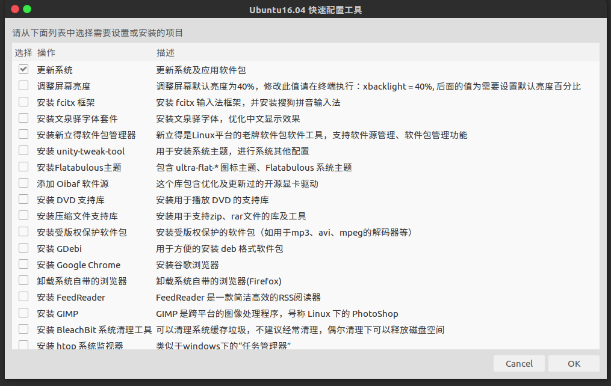

# ubuntu 快速配置工具

##  执行以下命令直接启动。

>注意不兼容 sh，需要使用 bash 执行。

> 如果需要添加其他软件，可以通过提交 issue 的方式提交

    wget -qO- https://raw.githubusercontent.com/djanedu/ubuntu_init/master/ubuntu-init.sh | bash

## 运行截图如下

